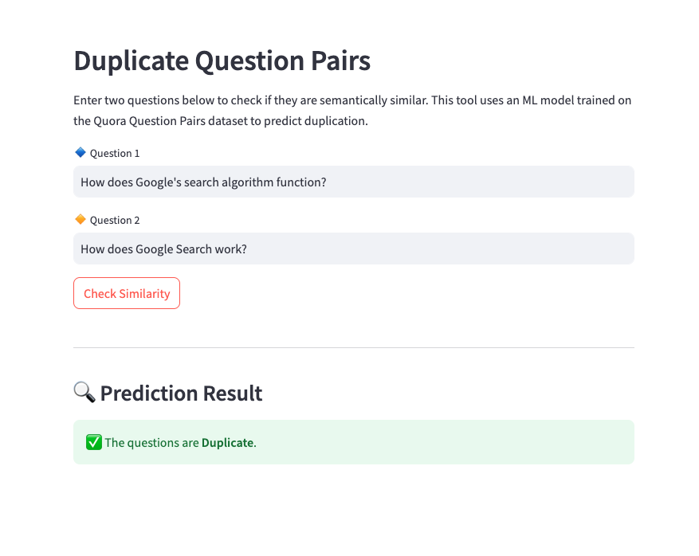

# Quora-Duplicate-Question-Pairs
🔍 A Natural Language Processing (NLP) project to detect duplicate questions using the Quora Question Pairs dataset. It combines handcrafted text features with machine learning to classify question pairs. 

## 📌 Project Description

Quora is a widely used Q&A platform, but it suffers from duplicated questions phrased differently. Automatically detecting such duplicates improves search results, content relevance, and user experience.

This project tackles the challenge by training machine learning models on semantic, syntactic, and statistical features extracted from question pairs. Since misclassifying duplicates can negatively impact user experience, special focus was given to improving recall. The final model uses Random Forest trained on Word2Vec-based features, outperforming basic Bag-of-Words approaches.

This project was originally inspired by the Kaggle challenge:  
🔗 [Quora Question Pairs Competition](https://www.kaggle.com/c/quora-question-pairs)

## 📊 Dataset Overview

- **Size**: 404,351 question pairs  
- **Class distribution**:
  - 255,045  non-duplicate pairs
  - 149,306  duplicate pairs
- **Task**: Binary classification (Duplicate vs. Not Duplicate)


## 🧩 Features

### **User Interface Features**
- Streamlit web app with clean UI
- Takes any two questions as input
- Real-time prediction: Duplicate or Not Duplicate

### **Model Features**
- Random Forest classifier (chosen for better recall)
- Word2Vec embeddings used for vector representation
- Handcrafted NLP features for token and text-level similarity
- Compared against Bag-of-Words (BoW) and XGBoost

## 🛠️ NLP Techniques Used

- Stopword removal
- Lemmatization
- Tokenization
- Word2Vec embeddings (custom trained)


## 🔧 Handcrafted Features Used

### **1. Token-Based Features**
- `cwc_min`, `cwc_max`: Common word count ratios
- `csc_min`, `csc_max`: Common stop word ratios
- `ctc_min`, `ctc_max`: Common token count ratios
- `first_word_eq`, `last_word_eq`: Binary match indicators

### **2. Length-Based Features**
- `mean_len`: Mean number of words in the questions
- `abs_len_diff`: Absolute length difference
- `longest_substr_ratio`: Longest common substring ratio

### **3. Fuzzy Matching Features**
- `fuzz_ratio`, `fuzz_partial_ratio`, `token_sort_ratio`, `token_set_ratio`: Scores from fuzzywuzzy


## ⚙️ Models Tried

| Model                  | Features Used              | Notes                                      |
|------------------------|----------------------------|---------------------------------------|
| XGBoost/ Random Forest | Bag-of-Words + handcrafted | Good precision, lower recall          |
| XGBoost/ Random Forest | Word2Vec + handcrafted     | Final model (better recall, balanced) |


## 📈 Evaluation Metrics

- Accuracy
- Confusion Matrix
- Emphasis on **Recall** to minimize missed duplicates


## Project Structure
```
📦 quora-duplicate-question-pairs
├── app.py               # Streamlit UI
├── helper.py            # NLP preprocessing steps
├── word2vec.model       # Trained Word2Vec model
├── wv_rf.pkl            # Random Forest classifier
├── training resources/  # EDA + model building notebook
├── ├── DuplicateQuestionPair-lemma+word2vec.ipynb
├── ├── DuplicateQuestionPair-spacy-preprocessing_data.ipynb
├── ├── DuplicateQuestionPair.ipynb
├── requirements.txt              # Dependencies
└── README.md                     # Project overview
```
### How to Run

Follow these steps to get the project up and running on your local machine:

1. Clone the Repository
```
git clone git@github.com:neethu-codes/Quora-Duplicate-Question-Pairs.git
cd Quora-Duplicate-Question-Pairs
```

2. Create and activate the Virtual Environment 
```
python -m venv venv
source venv/bin/activate # On macOS/Linux:
.\venv\Scripts\activate # On Windows
```

3. Install Dependencies
```
pip install -r requirements.txt
```

4. Prepare the Data

Ensure you have the AirPassengers.csv file in the root directory of your project. This file is crucial for the application to load and process the historical data.

5. Run the Streamlit Application
```
streamlit run app.py
```

## App Screenshot
Here is a glimpse of the streamlit app UI.


